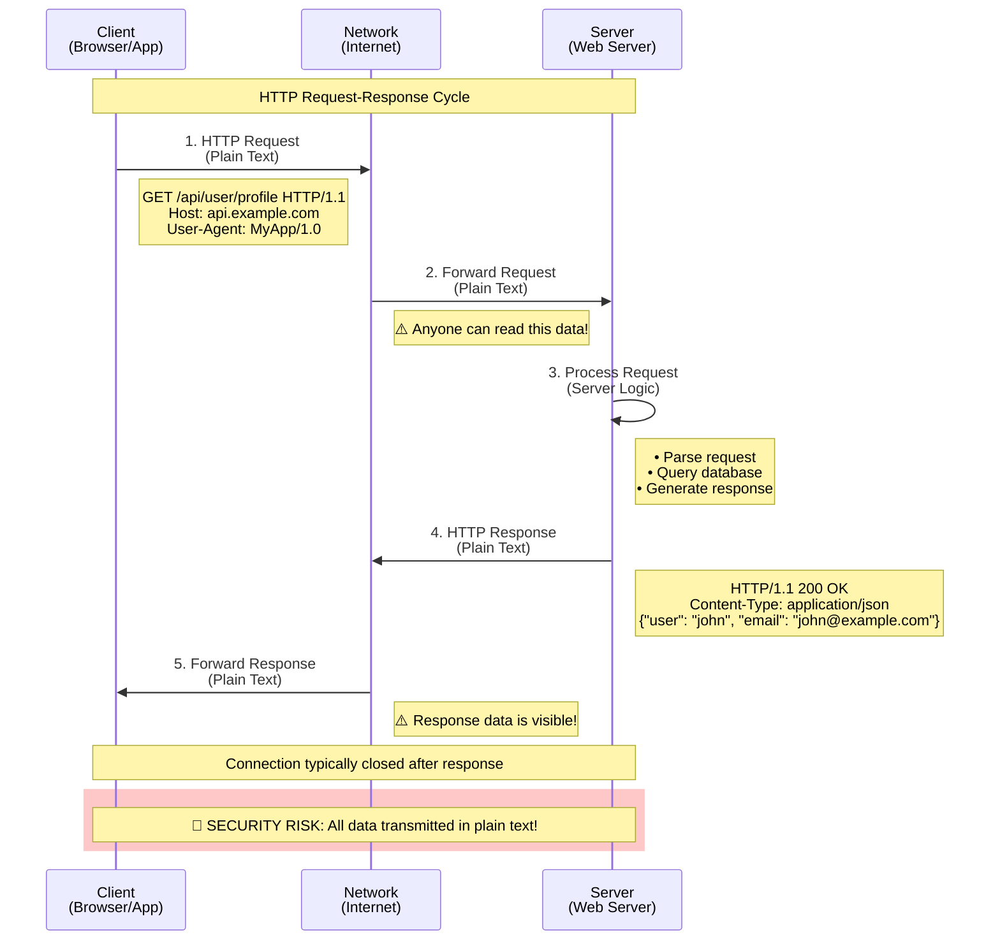
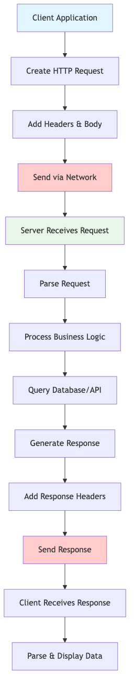
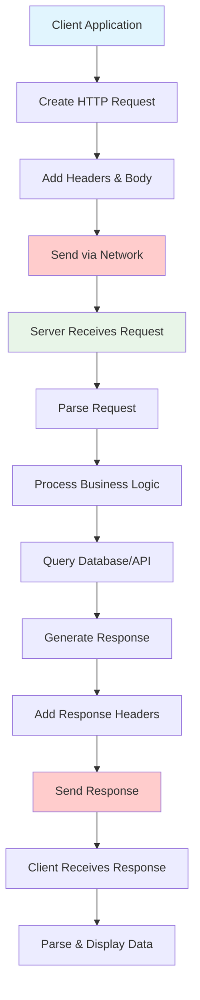
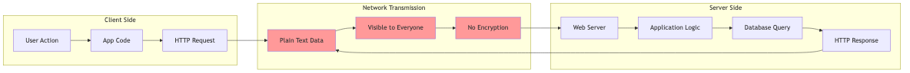
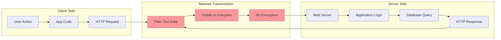
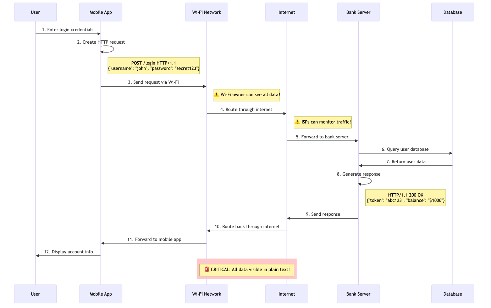
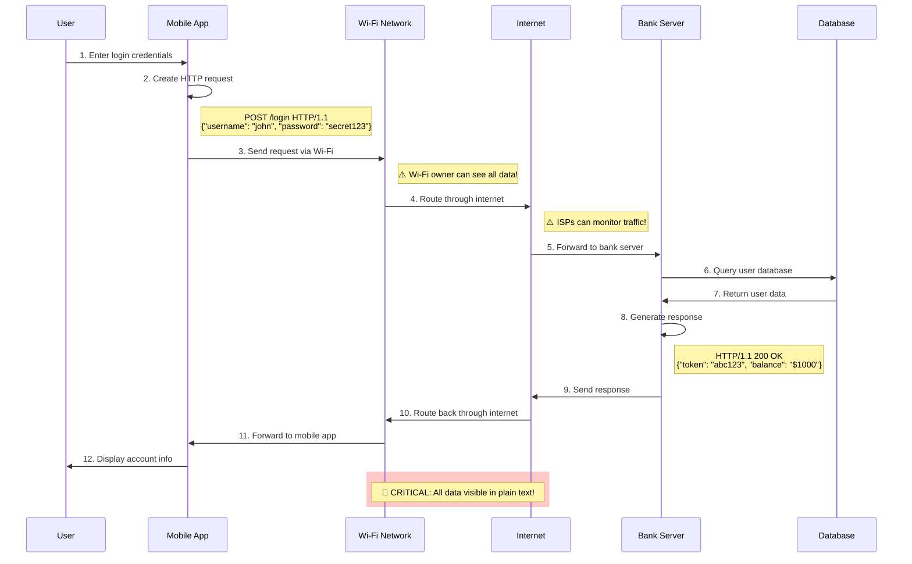

# HTTP Fundamentals: Understanding the Protocol and Its Security Risks

*Learn the basics of HTTP, why it's insecure, and how it became the foundation of modern web communication*

## Introduction

HTTP (HyperText Transfer Protocol) is the backbone of the internet. Every time you visit a website, send a message, or use a mobile app, you're likely using HTTP. But what exactly is HTTP, and why is it considered insecure?

In this comprehensive guide, we'll explore:
- What HTTP is and how it works
- Why HTTP is fundamentally insecure
- Real-world examples of HTTP vulnerabilities
- The evolution from HTTP to HTTPS

## What is HTTP?

HTTP (HyperText Transfer Protocol) is a protocol that defines how messages are formatted and transmitted between web browsers and servers. It's the foundation of data communication on the World Wide Web.

### **How HTTP Works**

HTTP follows a simple **client-server model**:

1. **Client Request**: Your app or browser sends a request to a server
2. **Server Processing**: The server processes the request
3. **Server Response**: The server sends back the requested data
4. **Connection Close**: The connection is typically closed after the response

#### **Visual Representation: HTTP Communication Flow**


*Figure 1: HTTP Request-Response Cycle showing plain text transmission and security risks*



#### **HTTP Request-Response Anatomy**


*Figure 2: Complete HTTP process flow from user action to data display*



#### **HTTP Data Flow Visualization**


*Figure 3: Data flow between client, network, and server components*



#### **Real-World HTTP Example Flow**


*Figure 4: Complete banking login scenario showing security vulnerabilities at each step*



### **HTTP Request Structure**

```http
GET /api/user/profile HTTP/1.1
Host: api.example.com
User-Agent: MyApp/1.0
Accept: application/json
Content-Type: application/json

{
  "user_id": "12345"
}
```

**Request Components:**
- **Method**: GET, POST, PUT, DELETE, etc.
- **URL**: The resource being requested
- **Headers**: Metadata about the request
- **Body**: Data being sent (for POST/PUT requests)

### **HTTP Response Structure**

```http
HTTP/1.1 200 OK
Content-Type: application/json
Content-Length: 156
Server: nginx/1.18.0
Date: Mon, 27 Jan 2025 10:00:00 GMT

{
  "user": {
    "id": "12345",
    "name": "John Doe",
    "email": "john@example.com",
    "password": "secret123"
  }
}
```

**Response Components:**
- **Status Code**: 200 (success), 404 (not found), 500 (server error)
- **Headers**: Metadata about the response
- **Body**: The actual data being returned

## Why HTTP is Not Secure

HTTP transmits data in **plain text**, making it vulnerable to several types of attacks:

### **1. No Encryption**

**The Problem**: All data is sent as readable text that anyone can intercept and read.

```http
# What you send:
POST /login HTTP/1.1
Content-Type: application/json

{"username": "john", "password": "mypassword123"}

# What an attacker sees:
POST /login HTTP/1.1
Content-Type: application/json

{"username": "john", "password": "mypassword123"}
```

**Real-World Impact:**
- Passwords are visible in plain text
- Credit card numbers can be stolen
- Personal information is exposed
- API keys and tokens are readable

### **2. No Authentication**

**The Problem**: There's no way to verify the server's identity.

**Attack Scenarios:**
- **Phishing**: Attackers can create fake websites that look identical to legitimate ones
- **DNS Hijacking**: Malicious actors can redirect traffic to fake servers
- **Man-in-the-Middle**: Attackers can intercept and modify requests

**Example Attack:**
```http
# User thinks they're connecting to:
https://bank.com/login

# But actually connecting to:
https://fake-bank.com/login
# (Looks identical but steals credentials)
```

### **3. No Data Integrity**

**The Problem**: No way to detect if data was modified during transmission.

**Attack Scenarios:**
- **Data Tampering**: Attackers can modify requests and responses
- **Injection Attacks**: Malicious code can be injected into responses
- **Corrupted Data**: Data can be corrupted without detection

**Example:**
```http
# Original response:
{"balance": "$1,000.00"}

# Modified response:
{"balance": "$10,000.00"}
```

## Real-World HTTP Vulnerabilities

### **1. Public Wi-Fi Attacks**

**Scenario**: Using HTTP on public Wi-Fi

```http
# What you send on coffee shop Wi-Fi:
GET /api/account/balance HTTP/1.1
Host: mybank.com
Authorization: Bearer abc123xyz789

# What the attacker sees:
GET /api/account/balance HTTP/1.1
Host: mybank.com
Authorization: Bearer abc123xyz789
```

**Result**: Attacker can see your bank balance and use your token to access your account.

### **2. Corporate Network Interception**

**Scenario**: Corporate networks often intercept HTTP traffic

```http
# Employee sends:
POST /api/send-email HTTP/1.1
Content-Type: application/json

{
  "to": "client@company.com",
  "subject": "Confidential Project Details",
  "body": "Here are the secret project files..."
}

# IT department sees:
POST /api/send-email HTTP/1.1
Content-Type: application/json

{
  "to": "client@company.com",
  "subject": "Confidential Project Details",
  "body": "Here are the secret project files..."
}
```

**Result**: All confidential communications are visible to network administrators.

### **3. Mobile App Vulnerabilities**

**Scenario**: Mobile apps using HTTP for API calls

```swift
// What your iOS app sends:
let url = URL(string: "http://api.myapp.com/user/login")!
var request = URLRequest(url: url)
request.httpMethod = "POST"
request.setValue("application/json", forHTTPHeaderField: "Content-Type")

let loginData = [
    "username": "john_doe",
    "password": "secretpassword123"
]

request.httpBody = try JSONSerialization.data(withJSONObject: loginData)

// What an attacker sees:
// Complete login credentials in plain text
```

**Result**: User credentials are exposed to anyone monitoring network traffic.

## HTTP vs HTTPS: The Security Evolution

### **HTTP Limitations Summary**

| Aspect | HTTP | Security Risk |
|--------|------|---------------|
| **Data Transmission** | Plain text | Anyone can read your data |
| **Server Authentication** | None | Can't verify server identity |
| **Data Integrity** | None | Data can be modified |
| **Privacy** | None | All communication is visible |
| **Trust** | None | No way to verify authenticity |

### **The Need for HTTPS**

HTTP's security limitations led to the development of HTTPS (HTTP Secure), which adds:

- **Encryption**: All data is encrypted before transmission
- **Authentication**: Server identity is verified using certificates
- **Data Integrity**: Ensures data hasn't been tampered with
- **Privacy**: Communication is protected from eavesdropping

## Modern HTTP Usage

### **When HTTP is Still Used**

Despite its security risks, HTTP is still used in:

1. **Development Environments**: Local development servers
2. **Internal Networks**: Trusted corporate networks
3. **Legacy Systems**: Older systems that haven't been updated
4. **Testing**: Non-production environments

### **Best Practices for HTTP**

If you must use HTTP:

1. **Never send sensitive data**: No passwords, tokens, or personal information
2. **Use only for public data**: Static content that doesn't need protection
3. **Implement additional security**: Use application-level encryption
4. **Monitor for attacks**: Implement logging and monitoring
5. **Plan migration**: Always plan to migrate to HTTPS

## Conclusion

HTTP revolutionized the internet by providing a simple way to share information. However, its plain-text nature makes it fundamentally insecure for modern applications that handle sensitive data.

**Key Takeaways:**
- HTTP transmits data in plain text
- No authentication or data integrity protection
- Vulnerable to interception and modification
- Unsuitable for sensitive applications
- HTTPS is the secure evolution of HTTP

**Next Steps:**
- Learn about [HTTPS and encryption](https://medium.com/@yourusername/https-encryption-complete-guide)
- Understand [SSL/TLS certificates](https://medium.com/@yourusername/ssl-certificates-explained)
- Implement [SSL pinning for mobile apps](https://medium.com/@yourusername/ssl-pinning-ios-adr)

---

**Tags:** `http`, `web-security`, `networking`, `protocols`, `cybersecurity`

**Meta Description:** Complete guide to HTTP protocol fundamentals and security risks. Learn why HTTP is insecure and how it led to HTTPS development.

**Image Suggestions:**
- HTTP request/response flow diagram
- Plain text vs encrypted data comparison
- Network interception attack visualization
- HTTP vs HTTPS security comparison chart
