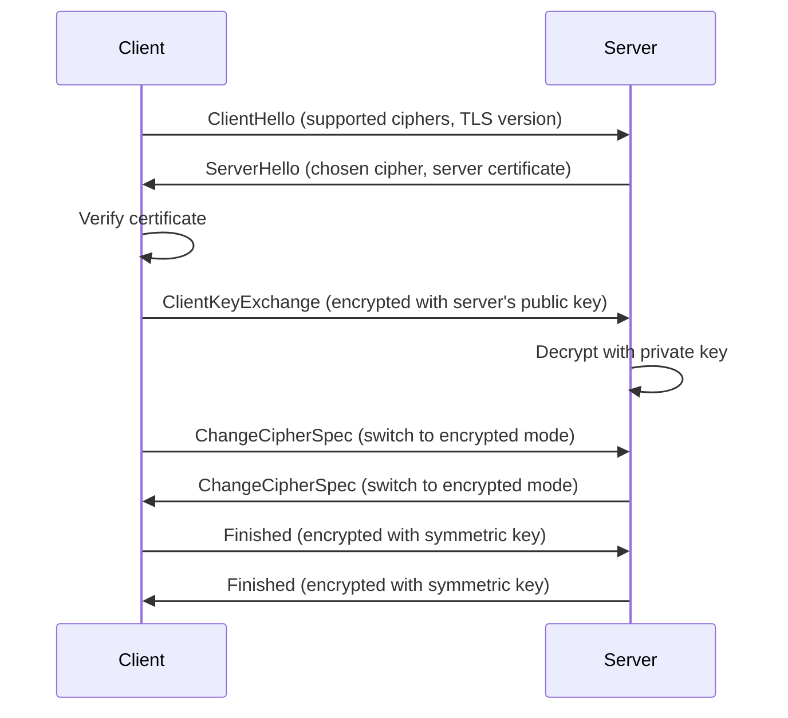

# HTTPS Encryption: Complete Guide to TLS/SSL and Modern Web Security

*Master the encryption mechanisms that secure the modern web, from basic concepts to advanced cryptographic implementations*

## Introduction

HTTPS (HTTP Secure) is the secure version of HTTP that protects your data as it travels across the internet. But how does it actually work? What encryption algorithms are used? And why is it still not completely secure?

In this comprehensive guide, we'll explore:
- How HTTPS encryption works in detail
- The types of encryption used (asymmetric vs symmetric)
- Key exchange mechanisms and algorithms
- Perfect Forward Secrecy and modern security standards
- Why HTTPS still has vulnerabilities

## What is HTTPS?

HTTPS (HTTP Secure) adds a security layer on top of HTTP using **TLS/SSL encryption**. It's like putting your data in a secure, locked box before sending it through the internet.

### **What HTTPS Provides:**

**🔒 Encryption**: All data is encrypted before transmission using advanced cryptographic algorithms
**🔐 Authentication**: Verifies the server's identity using digital certificates
**✅ Data Integrity**: Ensures data hasn't been tampered with using message authentication codes (MACs)

## Types of Encryption Used in HTTPS

HTTPS uses a **hybrid encryption system** that combines two types of encryption:

### **1. Asymmetric Encryption (Public Key Cryptography)**

**Purpose**: Secure key exchange and authentication
**Algorithms**: RSA, ECDSA, EdDSA
**How it works**: Uses a pair of keys (public + private)
**Speed**: Slower, used only for initial handshake

**Key Characteristics:**
- **Public Key**: Can be shared openly, used to encrypt data
- **Private Key**: Kept secret, used to decrypt data
- **One-way function**: Easy to encrypt with public key, nearly impossible to decrypt without private key

### **2. Symmetric Encryption (Shared Secret)**

**Purpose**: Encrypt actual data transmission
**Algorithms**: AES-128, AES-256, ChaCha20
**How it works**: Both parties use the same key
**Speed**: Much faster, used for bulk data encryption

**Key Characteristics:**
- **Same Key**: Both client and server use identical keys
- **Fast**: Optimized for high-speed data encryption
- **Secure**: When properly implemented, extremely difficult to break

## How HTTPS Encryption Works - The Complete Process

### **Step 1: TLS Handshake (Asymmetric Encryption)**



**Detailed Handshake Process:**

1. **Client Hello**: 
   ```http
   TLS Version: 1.3
   Cipher Suites: [TLS_AES_256_GCM_SHA384, TLS_CHACHA20_POLY1305_SHA256]
   Random: [32 random bytes]
   ```

2. **Server Hello**:
   ```http
   TLS Version: 1.3
   Cipher Suite: TLS_AES_256_GCM_SHA384
   Server Certificate: [X.509 certificate with public key]
   Random: [32 random bytes]
   ```

3. **Key Exchange**:
   ```swift
   // Client generates a random pre-master secret
   let preMasterSecret = generateRandomBytes(32)
   
   // Client encrypts it with server's public key
   let encryptedPreMaster = RSAEncrypt(preMasterSecret, serverPublicKey)
   
   // Server decrypts with its private key
   let decryptedPreMaster = RSADecrypt(encryptedPreMaster, serverPrivateKey)
   ```

### **Step 2: Key Derivation (Creating Symmetric Keys)**

Both client and server derive the same symmetric keys from the pre-master secret:

```swift
// Pseudo-code for key derivation
func deriveKeys(preMasterSecret: Data, clientRandom: Data, serverRandom: Data) -> (clientKey: Data, serverKey: Data) {
    let seed = preMasterSecret + clientRandom + serverRandom
    
    // Use HKDF (HMAC-based Key Derivation Function)
    let clientKey = HKDF(seed: seed, info: "client key", length: 32)
    let serverKey = HKDF(seed: seed, info: "server key", length: 32)
    
    return (clientKey, serverKey)
}
```

### **Step 3: Symmetric Encryption (Bulk Data)**

Once the symmetric keys are established, all data is encrypted using fast symmetric encryption:

```swift
// Example of AES-256-GCM encryption
func encryptData(_ data: Data, key: Data, iv: Data) -> (ciphertext: Data, tag: Data) {
    let cipher = AES(key: key, mode: .GCM, iv: iv)
    let encrypted = cipher.encrypt(data)
    let tag = cipher.getAuthenticationTag()
    
    return (encrypted, tag)
}

// Example of ChaCha20-Poly1305 encryption
func encryptWithChaCha20(_ data: Data, key: Data, nonce: Data) -> (ciphertext: Data, tag: Data) {
    let cipher = ChaCha20Poly1305(key: key, nonce: nonce)
    let encrypted = cipher.encrypt(data)
    let tag = cipher.getAuthenticationTag()
    
    return (encrypted, tag)
}
```

## Encryption Algorithms Used in Modern HTTPS

### **Asymmetric Encryption (Key Exchange)**

#### **RSA (Rivest-Shamir-Adleman)**
- **Key Sizes**: 2048-bit (minimum), 4096-bit (recommended)
- **Security**: Based on factoring large integers
- **Performance**: Slower than elliptic curves
- **Usage**: Legacy systems, certificate signing

#### **ECDSA (Elliptic Curve Digital Signature Algorithm)**
- **Key Sizes**: 256-bit (equivalent to 3072-bit RSA)
- **Security**: Based on elliptic curve discrete logarithm
- **Performance**: Faster than RSA
- **Usage**: Modern certificates, digital signatures

#### **EdDSA (Edwards Curve Digital Signature Algorithm)**
- **Key Sizes**: 256-bit (Ed25519), 448-bit (Ed448)
- **Security**: Based on Edwards curves
- **Performance**: Fastest asymmetric algorithm
- **Usage**: Modern applications, high-performance systems

#### **ECDH (Elliptic Curve Diffie-Hellman)**
- **Purpose**: Key exchange without authentication
- **Security**: Based on elliptic curve discrete logarithm
- **Performance**: Very fast
- **Usage**: Perfect Forward Secrecy, ephemeral key exchange

### **Symmetric Encryption (Data Encryption)**

#### **AES (Advanced Encryption Standard)**
- **AES-128-GCM**: 128-bit key, Galois/Counter Mode
- **AES-256-GCM**: 256-bit key, Galois/Counter Mode
- **Security**: Extremely secure, government-approved
- **Performance**: Very fast on modern hardware
- **Usage**: Most common symmetric encryption

#### **ChaCha20-Poly1305**
- **Key Size**: 256-bit
- **Security**: Stream cipher with authentication
- **Performance**: Fast on all platforms
- **Usage**: Mobile devices, high-performance servers

#### **AES-CBC (Cipher Block Chaining)**
- **Security**: Less secure than GCM
- **Performance**: Fast but requires separate authentication
- **Usage**: Legacy systems (being phased out)

## Perfect Forward Secrecy (PFS)

Modern HTTPS implementations use **Perfect Forward Secrecy**, which means:

```swift
// Each session generates unique keys
func establishNewSession() -> SessionKeys {
    // Generate ephemeral (temporary) key pair
    let ephemeralKeyPair = generateEphemeralKeyPair()
    
    // Use ECDH for key exchange
    let sharedSecret = ECDH(clientPrivateKey, serverPublicKey)
    
    // Derive session keys
    let sessionKeys = deriveSessionKeys(sharedSecret)
    
    // Discard ephemeral keys immediately
    secureDelete(ephemeralKeyPair.privateKey)
    
    return sessionKeys
}
```

**Benefits of PFS:**
- Even if server's private key is compromised later, past sessions remain secure
- Each session uses unique, temporary keys
- Keys are destroyed after the session ends
- Provides protection against mass surveillance

## Real-World Example: Complete HTTPS Request

```http
# What your app sends (encrypted):
POST /api/login HTTP/1.1
Host: api.bank.com
Content-Type: application/json
Content-Length: 45
Authorization: Bearer [ENCRYPTED_TOKEN]

[ENCRYPTED_JSON_DATA]

# What an attacker sees:
POST /api/login HTTP/1.1
Host: api.bank.com
Content-Type: application/json
Content-Length: 45
Authorization: Bearer [GARBAGE_ENCRYPTED_DATA]

[COMPLETELY_UNREADABLE_ENCRYPTED_DATA]
```

## Why This Hybrid Approach?

### **Performance Optimization**
- **Asymmetric encryption** is secure but slow → Used only for initial key exchange
- **Symmetric encryption** is fast but requires shared keys → Used for bulk data
- **Best of both worlds**: Security of asymmetric + speed of symmetric

### **Security Benefits**
- **Perfect Forward Secrecy** ensures past sessions remain secure even if keys are compromised
- **Authentication** ensures you're talking to the right server
- **Integrity** ensures data hasn't been tampered with
- **Confidentiality** ensures data is protected from eavesdropping

## Why HTTPS is Still Not Completely Secure

Despite HTTPS being much more secure than HTTP, it's not foolproof:

### **Certificate Authority (CA) Vulnerabilities**
- **Compromised CAs**: If a Certificate Authority is hacked, attackers can issue fake certificates
- **Rogue CAs**: Some CAs might issue certificates for domains they don't control
- **Government CAs**: Some governments can force CAs to issue certificates for surveillance

### **Certificate Validation Issues**
- **Expired Certificates**: Apps might accept expired certificates
- **Self-Signed Certificates**: Some apps accept certificates not from trusted CAs
- **Wildcard Certificates**: One certificate can be used for multiple subdomains

### **Network-Level Attacks**
- **DNS Hijacking**: Redirecting traffic to malicious servers
- **BGP Hijacking**: Routing traffic through attacker-controlled networks
- **Corporate Proxies**: Some corporate networks use their own certificates

### **Implementation Vulnerabilities**
- **Weak Cipher Suites**: Older, less secure encryption methods
- **Protocol Downgrade**: Forcing connections to use weaker protocols
- **Padding Oracle Attacks**: Exploiting encryption implementation flaws

## Modern HTTPS Best Practices

### **1. Use Strong Cipher Suites**
```swift
// Recommended cipher suites for 2025
let supportedCiphers = [
    "TLS_AES_256_GCM_SHA384",
    "TLS_CHACHA20_POLY1305_SHA256",
    "TLS_AES_128_GCM_SHA256"
]
```

### **2. Implement Certificate Pinning**
```swift
// Pin specific certificates to prevent CA compromise
let pinnedCertificates = loadPinnedCertificates()
let delegate = PinnedURLSessionDelegate(certificates: pinnedCertificates)
```

### **3. Use TLS 1.3**
```swift
// Configure for TLS 1.3 only
let config = URLSessionConfiguration.default
config.tlsMinimumSupportedProtocolVersion = .TLSv13
```

### **4. Implement Perfect Forward Secrecy**
```swift
// Use ephemeral key exchange
let keyExchange = ECDHEKeyExchange(curve: .secp256r1)
```

## Conclusion

HTTPS provides a robust security foundation for modern web communication through its hybrid encryption approach. By combining asymmetric encryption for key exchange with symmetric encryption for data transmission, it achieves both security and performance.

**Key Takeaways:**
- HTTPS uses hybrid encryption (asymmetric + symmetric)
- Perfect Forward Secrecy protects past sessions
- Modern algorithms like AES-256-GCM and ChaCha20-Poly1305 are highly secure
- Certificate validation can still be compromised
- Additional security measures like certificate pinning are recommended

**Next Steps:**
- Learn about [SSL/TLS certificates](https://medium.com/@yourusername/ssl-certificates-explained)
- Implement [SSL pinning for mobile apps](https://medium.com/@yourusername/ssl-pinning-ios-adr)
- Understand [Application Detection and Response (ADR)](https://medium.com/@yourusername/ssl-pinning-ios-adr)

---

**Tags:** `https`, `encryption`, `tls`, `ssl`, `cybersecurity`

**Meta Description:** Complete guide to HTTPS encryption, TLS/SSL protocols, and modern web security. Learn asymmetric vs symmetric encryption, key exchange, and security best practices.

**Image Suggestions:**
- HTTPS encryption flow diagram
- Asymmetric vs symmetric encryption comparison
- TLS handshake sequence diagram
- Encryption algorithm performance comparison chart

