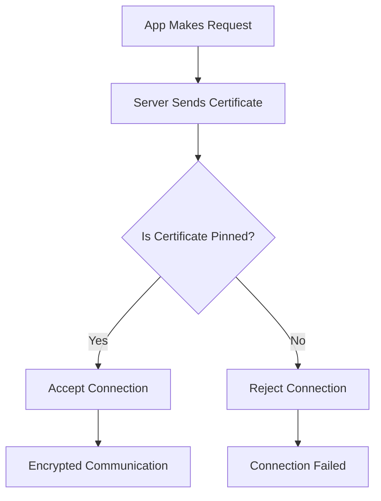

# SSL/Certificate Pinning : What, Why, How | iOS , ADR

*Your banking app just got hacked. A malicious proxy intercepted your login credentials, and you never knew it happened. This isn't a nightmare scenario—it's happening to thousands of users daily.*

*Master SSL/Certificate pinning techniques to secure your iOS apps and implement robust Application Detection and Response (ADR) systems that can prevent these attacks in real-time.*

## 1. Understanding HTTP and HTTPS Fundamentals

Before diving into SSL pinning, it's crucial to understand the foundation of web security. This section provides a high-level overview of HTTP and HTTPS protocols.

### **HTTP: The Insecure Foundation**

HTTP (HyperText Transfer Protocol) is the foundation of data communication on the web, but it has a fundamental security flaw: **all data is transmitted in plain text**.

**Key HTTP Problems:**
- **No Encryption**: Anyone can read your data
- **No Authentication**: Can't verify server identity  
- **No Data Integrity**: Data can be modified in transit

**Real-World Impact:**
```http
# What you send:
POST /login HTTP/1.1
Content-Type: application/json
{"username": "john", "password": "mypassword123"}

# What an attacker sees:
POST /login HTTP/1.1
Content-Type: application/json
{"username": "john", "password": "mypassword123"}
```

### **HTTPS: The Secure Evolution**

HTTPS (HTTP Secure) adds encryption, authentication, and data integrity to HTTP using TLS/SSL protocols.

**HTTPS Security Features:**
- **🔒 Encryption**: All data encrypted before transmission
- **🔐 Authentication**: Server identity verified using certificates
- **✅ Data Integrity**: Ensures data hasn't been tampered with

**How HTTPS Works:**
1. **Handshake**: Client and server establish secure connection
2. **Certificate Exchange**: Server proves its identity
3. **Key Exchange**: Both parties agree on encryption keys
4. **Encrypted Communication**: All data encrypted using shared keys

### **Why HTTPS Still Has Vulnerabilities**

Despite being much more secure than HTTP, HTTPS isn't foolproof:

**Certificate Authority (CA) Vulnerabilities:**
- **Compromised CAs**: If a CA is hacked, attackers can issue fake certificates
- **Rogue CAs**: Some CAs might issue certificates for domains they don't control
- **Government CAs**: Governments can force CAs to issue certificates for surveillance

**Network-Level Attacks:**
- **DNS Hijacking**: Redirecting traffic to malicious servers
- **BGP Hijacking**: Routing traffic through attacker-controlled networks
- **Corporate Proxies**: Some corporate networks use their own certificates

> **📚 Deep Dive**: For a comprehensive understanding of HTTP and HTTPS, including detailed encryption mechanisms, key exchange algorithms, and security implementations, read our detailed guides:
> - [HTTP Fundamentals: Understanding the Protocol and Its Security Risks](http-fundamentals-security-risks.md)
> - [HTTPS Encryption: Complete Guide to TLS/SSL and Modern Web Security](https-encryption-complete-guide.md)

## 3. MITM Attacks - The Real Threat

**Man-in-the-Middle (MITM) attacks** occur when an attacker intercepts communication between your app and the server.

### **How MITM Attacks Work:**

1. **Interception**: Attacker positions themselves between client and server
2. **Certificate Spoofing**: Attacker presents a fake certificate
3. **Data Theft**: All data passes through the attacker's system
4. **Silent Operation**: User and server are unaware of the attack

### **Real-World Example with Charles Proxy:**

**Charles Proxy** is a popular tool used by developers (and attackers) to intercept HTTPS traffic:

```swift
// What your app thinks it's doing:
let url = URL(string: "https://api.bank.com/login")!
let task = URLSession.shared.dataTask(with: url) { data, response, error in
    // Process login response
}

// What actually happens with Charles:
// 1. Charles intercepts the request
// 2. Charles presents its own certificate
// 3. Your app accepts Charles' certificate
// 4. Charles sees all your data in plain text
// 5. Charles forwards the request to the real server
// 6. Charles forwards the response back to your app
```

**What Charles Can See:**
- Login credentials
- API keys and tokens
- Personal information
- Financial data
- Any sensitive information your app sends

## 4. Why We Need Certificate Pinning

This is exactly why we need **Certificate Pinning**! 

### **The Problem:**
- HTTPS relies on trusting Certificate Authorities
- If a CA is compromised, attackers can issue fake certificates
- Your app will accept these fake certificates as valid
- All your "secure" data becomes visible to attackers

### **The Solution:**
Certificate Pinning bypasses the CA system by hardcoding the expected certificate directly into your app.

**Instead of asking:** "Is this certificate from a trusted CA?"
**We ask:** "Is this the exact certificate we expect?"

## 5. What is a Certificate?

A **digital certificate** is like a digital passport that proves a server's identity.

### **Certificate Components:**

**📜 Certificate Data:**
- **Subject**: Who the certificate belongs to (e.g., api.bank.com)
- **Issuer**: Who issued the certificate (e.g., DigiCert)
- **Validity Period**: When the certificate is valid
- **Public Key**: Used for encryption

**🔐 Digital Signature:**
- **CA Signature**: Proves the certificate is legitimate
- **Hash**: Ensures the certificate hasn't been tampered with

### **Certificate Chain:**
```
Root CA Certificate (DigiCert Root CA)
    ↓ (signed by)
Intermediate CA Certificate (DigiCert SHA2 High Assurance Server CA)
    ↓ (signed by)
Server Certificate (api.bank.com)
```

**How Certificate Validation Works:**
1. **Check Validity**: Is the certificate still valid?
2. **Check Chain**: Can we trace back to a trusted root CA?
3. **Check Signature**: Is the certificate properly signed?
4. **Check Domain**: Does the certificate match the requested domain?

## 6. Theory: How SSL Pinning Works

SSL Pinning works by **bypassing the normal certificate validation process** and instead checking if the server's certificate matches a pre-configured "pinned" certificate.

### **Types of SSL Pinning:**

**1. Certificate Pinning** (Most Secure)
- Pins the entire certificate
- Most secure but requires updates when certificates expire
- Example: Pin the exact certificate file

**2. Public Key Pinning** (Balanced)
- Pins only the public key from the certificate
- Survives certificate renewals (same key, new certificate)
- Example: Pin the public key hash

**3. Hash Pinning** (Most Flexible)
- Pins a hash of the certificate or public key
- Most flexible approach
- Example: Pin SHA-256 hash

### **SSL Pinning Process:**



**Step-by-Step:**
1. **App Request**: Your app initiates a connection
2. **Certificate Exchange**: Server sends its certificate
3. **Pinning Check**: App compares certificate against pinned values
4. **Decision**: Accept if match, reject if no match
5. **Secure Communication**: Proceed with encrypted communication

## 7. iOS Implementation

Now let's implement SSL pinning in iOS with properly formatted code examples.

### **Step 1: Add Certificate to Bundle**

First, add your server's certificate to your iOS app bundle:

```swift
// 1. Download your server's certificate
// 2. Add it to your Xcode project
// 3. Make sure it's included in the app bundle
```

### **Step 2: Create SSL Pinning Manager**

```swift
import Foundation
import Security

class SSLPinningManager {
    
    // MARK: - Certificate Pinning
    static func loadPinnedCertificates() -> [Data] {
        var certificates: [Data] = []
        
        // Load primary certificate
        if let certPath = Bundle.main.path(forResource: "api_certificate", ofType: "cer"),
           let certData = NSData(contentsOfFile: certPath) {
            certificates.append(certData as Data)
        }
        
        // Load backup certificate
        if let backupCertPath = Bundle.main.path(forResource: "api_certificate_backup", ofType: "cer"),
           let backupCertData = NSData(contentsOfFile: backupCertPath) {
            certificates.append(backupCertData as Data)
        }
        
        return certificates
    }
    
    // MARK: - Public Key Pinning
    static func extractPublicKey(from certificate: SecCertificate) -> Data? {
        var publicKey: SecKey?
        let status = SecCertificateCopyPublicKey(certificate, &publicKey)
        
        guard status == errSecSuccess, let key = publicKey else {
            return nil
        }
        
        var error: Unmanaged<CFError>?
        guard let keyData = SecKeyCopyExternalRepresentation(key, &error) else {
            return nil
        }
        
        return keyData as Data
    }
    
    // MARK: - Hash Pinning
    static func generateCertificateHash(_ certificateData: Data) -> String {
        let hash = certificateData.sha256
        return hash.base64EncodedString()
    }
}

// MARK: - Data Extension for Hashing
extension Data {
    var sha256: Data {
        var hash = [UInt8](repeating: 0, count: Int(CC_SHA256_DIGEST_LENGTH))
        self.withUnsafeBytes {
            _ = CC_SHA256($0.baseAddress, CC_LONG(self.count), &hash)
        }
        return Data(hash)
    }
}
```

### **Step 3: Implement URLSession Delegate**

```swift
import Foundation
import Security

class PinnedURLSessionDelegate: NSObject, URLSessionDelegate {
    
    private let pinnedCertificates: [Data]
    private let adrManager: ADRManager
    
    init(pinnedCertificates: [Data], adrManager: ADRManager) {
        self.pinnedCertificates = pinnedCertificates
        self.adrManager = adrManager
        super.init()
    }
    
    // MARK: - URLSessionDelegate
    func urlSession(_ session: URLSession, 
                   didReceive challenge: URLAuthenticationChallenge, 
                   completionHandler: @escaping (URLSession.AuthChallengeDisposition, URLCredential?) -> Void) {
        
        // Only handle server trust challenges
        guard challenge.protectionSpace.authenticationMethod == NSURLAuthenticationMethodServerTrust,
              let serverTrust = challenge.protectionSpace.serverTrust else {
            completionHandler(.performDefaultHandling, nil)
            return
        }
        
        // Evaluate server trust
        var result: SecTrustResultType = .invalid
        let status = SecTrustEvaluate(serverTrust, &result)
        
        guard status == errSecSuccess else {
            adrManager.logSecurityEvent(.sslPinningFailed, 
                                      details: "SecTrustEvaluate failed with status: \(status)")
            completionHandler(.cancelAuthenticationChallenge, nil)
            return
        }
        
        // Get server certificate
        guard let serverCertificate = SecTrustGetCertificateAtIndex(serverTrust, 0) else {
            adrManager.logSecurityEvent(.sslPinningFailed, 
                                      details: "No server certificate found")
            completionHandler(.cancelAuthenticationChallenge, nil)
            return
        }
        
        // Convert certificate to Data
        let serverCertificateData = SecCertificateCopyData(serverCertificate)
        let serverData = CFDataCreateCopy(nil, serverCertificateData)
        let serverCertificateDataBytes = CFDataGetBytePtr(serverData)
        let serverCertificateDataLength = CFDataGetLength(serverData)
        let serverCertificateDataNS = NSData(bytes: serverCertificateDataBytes, 
                                           length: serverCertificateDataLength)
        
        // Check if server certificate matches any pinned certificate
        let isPinned = pinnedCertificates.contains { pinnedCert in
            pinnedCert == serverCertificateDataNS as Data
        }
        
        if isPinned {
            adrManager.logSecurityEvent(.sslPinningSuccess, 
                                      details: "Certificate validation successful")
            let credential = URLCredential(trust: serverTrust)
            completionHandler(.useCredential, credential)
        } else {
            adrManager.logSecurityEvent(.sslPinningFailed, 
                                      details: "Certificate doesn't match pinned certificates")
            completionHandler(.cancelAuthenticationChallenge, nil)
        }
    }
}
```

### **Step 4: Create Secure URLSession**

```swift
class SecureNetworkManager {
    
    static let shared = SecureNetworkManager()
    private let session: URLSession
    private let adrManager = ADRManager.shared
    
    private init() {
        // Load pinned certificates
        let pinnedCerts = SSLPinningManager.loadPinnedCertificates()
        
        // Create delegate with pinning
        let delegate = PinnedURLSessionDelegate(pinnedCertificates: pinnedCerts, 
                                              adrManager: adrManager)
        
        // Configure URLSession
        let config = URLSessionConfiguration.default
        config.timeoutIntervalForRequest = 30
        config.timeoutIntervalForResource = 60
        
        // Create session with custom delegate
        self.session = URLSession(configuration: config, 
                                 delegate: delegate, 
                                 delegateQueue: nil)
    }
    
    // MARK: - Secure API Calls
    func makeSecureRequest(to url: URL, 
                          completion: @escaping (Result<Data, Error>) -> Void) {
        
        let task = session.dataTask(with: url) { data, response, error in
            if let error = error {
                completion(.failure(error))
                return
            }
            
            guard let data = data else {
                completion(.failure(NetworkError.noData))
                return
            }
            
            completion(.success(data))
        }
        
        task.resume()
    }
}

// MARK: - Network Errors
enum NetworkError: Error {
    case noData
    case invalidURL
    case sslPinningFailed
}
```

### **Step 5: Usage Example**

```swift
class ViewController: UIViewController {
    
    private let networkManager = SecureNetworkManager.shared
    
    override func viewDidLoad() {
        super.viewDidLoad()
        makeSecureAPICall()
    }
    
    private func makeSecureAPICall() {
        guard let url = URL(string: "https://api.securebank.com/user/profile") else {
            return
        }
        
        networkManager.makeSecureRequest(to: url) { result in
            DispatchQueue.main.async {
                switch result {
                case .success(let data):
                    self.handleSuccess(data: data)
                case .failure(let error):
                    self.handleError(error: error)
                }
            }
        }
    }
    
    private func handleSuccess(data: Data) {
        // Process secure data
        print("Secure data received: \(data)")
    }
    
    private func handleError(error: Error) {
        // Handle SSL pinning failure
        print("Request failed: \(error.localizedDescription)")
    }
}
```

## 8. ADR Implementation

Application Detection and Response (ADR) monitors your app for security threats and responds automatically.

### **Step 1: Define Security Events**

```swift
import Foundation

enum SecurityEventType {
    case sslPinningFailed
    case sslPinningSuccess
    case jailbreakDetected
    case debuggerDetected
    case runtimeTampering
    case suspiciousNetworkActivity
    case certificateMismatch
    case appIntegrityViolation
}

enum ThreatLevel {
    case low
    case medium
    case high
    case critical
}

struct SecurityEvent {
    let type: SecurityEventType
    let timestamp: Date
    let details: String
    let threatLevel: ThreatLevel
    let userAgent: String
    let deviceInfo: String
    let stackTrace: String?
}
```

### **Step 2: Implement ADR Manager**

```swift
class ADRManager {
    static let shared = ADRManager()
    
    private var securityEvents: [SecurityEvent] = []
    private let maxEvents = 1000
    private var isMonitoring = false
    
    private init() {
        startSecurityMonitoring()
    }
    
    // MARK: - Event Logging
    func logSecurityEvent(_ type: SecurityEventType, 
                         details: String, 
                         stackTrace: String? = nil) {
        let event = SecurityEvent(
            type: type,
            timestamp: Date(),
            details: details,
            threatLevel: getThreatLevel(for: type),
            userAgent: getDeviceInfo(),
            deviceInfo: getSystemInfo(),
            stackTrace: stackTrace
        )
        
        securityEvents.append(event)
        
        // Keep only recent events
        if securityEvents.count > maxEvents {
            securityEvents.removeFirst(securityEvents.count - maxEvents)
        }
        
        // Respond to threats
        respondToThreat(event)
        
        // Send to backend
        sendEventToBackend(event)
    }
    
    // MARK: - Threat Detection
    private func startSecurityMonitoring() {
        guard !isMonitoring else { return }
        isMonitoring = true
        
        // Monitor for jailbreak
        checkJailbreak()
        
        // Monitor for debugger
        checkDebugger()
        
        // Monitor for runtime tampering
        checkRuntimeTampering()
        
        // Monitor app integrity
        checkAppIntegrity()
    }
    
    private func checkJailbreak() {
        let jailbreakIndicators = [
            "/Applications/Cydia.app",
            "/usr/sbin/sshd",
            "/bin/bash",
            "/etc/apt",
            "/private/var/lib/apt/",
            "/private/var/Users/",
            "/var/log/syslog",
            "/usr/libexec/sftp-server",
            "/Applications/RockApp.app",
            "/Applications/Icy.app",
            "/usr/bin/ssh"
        ]
        
        for indicator in jailbreakIndicators {
            if FileManager.default.fileExists(atPath: indicator) {
                logSecurityEvent(.jailbreakDetected, 
                               details: "Jailbreak indicator found: \(indicator)")
                return
            }
        }
        
        // Check for suspicious files
        let suspiciousFiles = [
            "/private/var/lib/cydia",
            "/private/var/mobile/Library/SBSettings/Themes",
            "/Library/MobileSubstrate/MobileSubstrate.dylib"
        ]
        
        for file in suspiciousFiles {
            if FileManager.default.fileExists(atPath: file) {
                logSecurityEvent(.jailbreakDetected, 
                               details: "Suspicious file found: \(file)")
            }
        }
    }
    
    private func checkDebugger() {
        var info = kinfo_proc()
        var mib: [Int32] = [CTL_KERN, KERN_PROC, KERN_PROC_PID, getpid()]
        var size = MemoryLayout<kinfo_proc>.stride
        
        let result = sysctl(&mib, u_int(mib.count), &info, &size, nil, 0)
        
        guard result == 0 else { return }
        
        if (info.kp_proc.p_flag & P_TRACED) != 0 {
            logSecurityEvent(.debuggerDetected, 
                           details: "Debugger attachment detected")
        }
    }
    
    private func checkRuntimeTampering() {
        // Check bundle location
        let bundlePath = Bundle.main.bundlePath
        if !bundlePath.hasPrefix("/var/containers/Bundle/Application/") {
            logSecurityEvent(.runtimeTampering, 
                           details: "Unexpected bundle location: \(bundlePath)")
        }
        
        // Check for hooking frameworks
        let hookingFrameworks = [
            "Substrate",
            "CydiaSubstrate", 
            "Frida",
            "Cycript",
            "Theos"
        ]
        
        for framework in hookingFrameworks {
            if dlopen(framework, RTLD_NOW) != nil {
                logSecurityEvent(.runtimeTampering, 
                               details: "Hooking framework detected: \(framework)")
            }
        }
        
        // Check for method swizzling
        checkMethodSwizzling()
    }
    
    private func checkMethodSwizzling() {
        // Check if critical methods have been swizzled
        let criticalMethods = [
            "URLSession:didReceiveChallenge:completionHandler:",
            "application:didFinishLaunchingWithOptions:",
            "viewDidLoad"
        ]
        
        for methodName in criticalMethods {
            // Implementation to detect method swizzling
            // This is a simplified example
        }
    }
    
    private func checkAppIntegrity() {
        // Check if app has been modified
        guard let bundlePath = Bundle.main.bundlePath else { return }
        
        // Check for common modification indicators
        let modificationIndicators = [
            "Payload/",
            ".app/",
            "Info.plist"
        ]
        
        for indicator in modificationIndicators {
            if bundlePath.contains(indicator) {
                logSecurityEvent(.appIntegrityViolation, 
                               details: "App integrity violation: \(indicator)")
            }
        }
    }
    
    // MARK: - Response Actions
    private func respondToThreat(_ event: SecurityEvent) {
        switch event.threatLevel {
        case .critical:
            respondToCriticalThreat(event)
        case .high:
            respondToHighThreat(event)
        case .medium:
            respondToMediumThreat(event)
        case .low:
            // Log only
            break
        }
    }
    
    private func respondToCriticalThreat(_ event: SecurityEvent) {
        DispatchQueue.main.async {
            self.showSecurityAlert()
            self.disableAppFunctionality()
            self.terminateApp()
        }
    }
    
    private func respondToHighThreat(_ event: SecurityEvent) {
        DispatchQueue.main.async {
            self.showSecurityWarning()
            self.limitAppFunctionality()
        }
    }
    
    private func respondToMediumThreat(_ event: SecurityEvent) {
        // Log and monitor
        print("Medium threat detected: \(event.details)")
    }
    
    private func showSecurityAlert() {
        let alert = UIAlertController(
            title: "Security Alert",
            message: "A critical security threat has been detected. The app will now close for your protection.",
            preferredStyle: .alert
        )
        
        alert.addAction(UIAlertAction(title: "OK", style: .default) { _ in
            exit(0)
        })
        
        if let windowScene = UIApplication.shared.connectedScenes.first as? UIWindowScene,
           let window = windowScene.windows.first {
            window.rootViewController?.present(alert, animated: true)
        }
    }
    
    private func showSecurityWarning() {
        let alert = UIAlertController(
            title: "Security Warning",
            message: "A potential security issue has been detected. Some features may be limited.",
            preferredStyle: .alert
        )
        
        alert.addAction(UIAlertAction(title: "Continue", style: .default))
        
        if let windowScene = UIApplication.shared.connectedScenes.first as? UIWindowScene,
           let window = windowScene.windows.first {
            window.rootViewController?.present(alert, animated: true)
        }
    }
    
    private func disableAppFunctionality() {
        UserDefaults.standard.set(false, forKey: "appFunctionalityEnabled")
        NotificationCenter.default.post(name: NSNotification.Name("DisableAppFunctionality"), object: nil)
    }
    
    private func limitAppFunctionality() {
        UserDefaults.standard.set(false, forKey: "fullAppAccess")
        NotificationCenter.default.post(name: NSNotification.Name("LimitAppFunctionality"), object: nil)
    }
    
    private func terminateApp() {
        DispatchQueue.main.asyncAfter(deadline: .now() + 2.0) {
            exit(0)
        }
    }
    
    // MARK: - Helper Methods
    private func getThreatLevel(for eventType: SecurityEventType) -> ThreatLevel {
        switch eventType {
        case .jailbreakDetected, .debuggerDetected, .runtimeTampering, .appIntegrityViolation:
            return .critical
        case .sslPinningFailed, .certificateMismatch:
            return .high
        case .suspiciousNetworkActivity:
            return .medium
        case .sslPinningSuccess:
            return .low
        }
    }
    
    private func getDeviceInfo() -> String {
        return UIDevice.current.model + " " + UIDevice.current.systemVersion
    }
    
    private func getSystemInfo() -> String {
        return "iOS \(UIDevice.current.systemVersion)"
    }
    
    private func sendEventToBackend(_ event: SecurityEvent) {
        // Implement secure backend reporting
        // This should use your secure API endpoint
        let eventData = [
            "type": event.type,
            "timestamp": event.timestamp.timeIntervalSince1970,
            "details": event.details,
            "threatLevel": event.threatLevel,
            "userAgent": event.userAgent,
            "deviceInfo": event.deviceInfo
        ]
        
        // Send to your security monitoring backend
        // Implementation depends on your backend setup
    }
}
```

### **Step 3: Integration with SSL Pinning**

```swift
// Update the PinnedURLSessionDelegate to use ADR
class PinnedURLSessionDelegate: NSObject, URLSessionDelegate {
    
    private let pinnedCertificates: [Data]
    private let adrManager = ADRManager.shared
    
    init(pinnedCertificates: [Data]) {
        self.pinnedCertificates = pinnedCertificates
        super.init()
    }
    
    func urlSession(_ session: URLSession, 
                   didReceive challenge: URLAuthenticationChallenge, 
                   completionHandler: @escaping (URLSession.AuthChallengeDisposition, URLCredential?) -> Void) {
        
        // ... existing SSL pinning code ...
        
        if isPinned {
            adrManager.logSecurityEvent(.sslPinningSuccess, 
                                      details: "Certificate validation successful")
            let credential = URLCredential(trust: serverTrust)
            completionHandler(.useCredential, credential)
        } else {
            adrManager.logSecurityEvent(.sslPinningFailed, 
                                      details: "Certificate doesn't match pinned certificates")
            completionHandler(.cancelAuthenticationChallenge, nil)
        }
    }
}
```

**What you'll learn in this tutorial:**
- Implement certificate pinning in iOS using multiple techniques
- Build Application Detection and Response (ADR) systems
- Handle certificate rotation and fallback mechanisms
- Detect and respond to runtime tampering attempts
- Integrate with enterprise security frameworks

## Prerequisites

Before we begin, make sure you have:
- [ ] Xcode 14.0 or later with iOS 15.0+ deployment target
- [ ] Basic understanding of iOS networking and URLSession
- [ ] Familiarity with SSL/TLS concepts and certificate management
- [ ] Access to your app's backend API certificates
- [ ] Understanding of iOS security frameworks (Security.framework)


*Figure 1: SSL Pinning Certificate Validation Flow*

## Step 1: Understanding SSL Pinning Fundamentals

SSL Pinning works by hardcoding the expected certificate or public key in your app, ensuring that only connections to servers with matching certificates are allowed. This prevents attackers from using their own certificates to intercept traffic.

### Types of SSL Pinning

**Certificate Pinning:** Pins the entire certificate (most secure but requires updates when certificates expire)

**Public Key Pinning:** Pins only the public key (more flexible, survives certificate renewals)

**Hash Pinning:** Pins a hash of the certificate or public key (most flexible)

```swift
import Foundation
import Security

class SSLPinningManager {
    // Certificate pinning - pins the entire certificate
    static func pinCertificate() -> [String: Any] {
        guard let certificatePath = Bundle.main.path(forResource: "api_certificate", ofType: "cer"),
              let certificateData = NSData(contentsOfFile: certificatePath) else {
            fatalError("Certificate file not found")
        }
        
        return [
            kSecType as String: kSecTypeCertificate,
            kSecClass as String: kSecClassCertificate,
            kSecValueData as String: certificateData
        ]
    }
    
    // Public key pinning - more flexible approach
    static func pinPublicKey() -> [String: Any] {
        // Implementation for public key pinning
        return [:]
    }
}
```

**Pro tip:** Always implement both certificate and public key pinning for maximum security and flexibility.


*Figure 2: Application Detection and Response Dashboard*

## Step 2: Implementing URLSession with SSL Pinning

Now let's implement a robust URLSession configuration that enforces SSL pinning. We'll create a custom URLSessionDelegate that validates certificates against our pinned values.

```swift
import Foundation
import Security

class PinnedURLSessionDelegate: NSObject, URLSessionDelegate {
    private let pinnedCertificates: [Data]
    private let adrManager: ADRManager
    
    init(pinnedCertificates: [Data], adrManager: ADRManager) {
        self.pinnedCertificates = pinnedCertificates
        self.adrManager = adrManager
        super.init()
    }
    
    func urlSession(_ session: URLSession, didReceive challenge: URLAuthenticationChallenge, completionHandler: @escaping (URLSession.AuthChallengeDisposition, URLCredential?) -> Void) {
        
        // Check if this is a server trust challenge
        guard challenge.protectionSpace.authenticationMethod == NSURLAuthenticationMethodServerTrust,
              let serverTrust = challenge.protectionSpace.serverTrust else {
            completionHandler(.performDefaultHandling, nil)
            return
        }
        
        // Evaluate the server trust
        var result: SecTrustResultType = .invalid
        let status = SecTrustEvaluate(serverTrust, &result)
        
        guard status == errSecSuccess else {
            adrManager.logSecurityEvent(.sslPinningFailed, details: "SecTrustEvaluate failed")
            completionHandler(.cancelAuthenticationChallenge, nil)
            return
        }
        
        // Get the server certificate
        guard let serverCertificate = SecTrustGetCertificateAtIndex(serverTrust, 0) else {
            adrManager.logSecurityEvent(.sslPinningFailed, details: "No server certificate found")
            completionHandler(.cancelAuthenticationChallenge, nil)
            return
        }
        
        // Convert to Data for comparison
        let serverCertificateData = SecCertificateCopyData(serverCertificate)
        let serverData = CFDataCreateCopy(nil, serverCertificateData)
        let serverCertificateDataBytes = CFDataGetBytePtr(serverData)
        let serverCertificateDataLength = CFDataGetLength(serverData)
        let serverCertificateDataNS = NSData(bytes: serverCertificateDataBytes, length: serverCertificateDataLength)
        
        // Check if server certificate matches any of our pinned certificates
        let isPinned = pinnedCertificates.contains { pinnedCert in
            pinnedCert == serverCertificateDataNS as Data
        }
        
        if isPinned {
            adrManager.logSecurityEvent(.sslPinningSuccess, details: "Certificate validation successful")
            let credential = URLCredential(trust: serverTrust)
            completionHandler(.useCredential, credential)
        } else {
            adrManager.logSecurityEvent(.sslPinningFailed, details: "Certificate doesn't match pinned certificates")
            completionHandler(.cancelAuthenticationChallenge, nil)
        }
    }
}
```

**Pro tip:** Always log SSL pinning events to your ADR system for security monitoring and incident response.


*Figure 3: iOS Security Framework Integration*

## Step 3: Building Application Detection and Response (ADR)

ADR systems monitor your app for security threats and respond automatically. Let's create a comprehensive ADR manager that detects various attack vectors and responds appropriately.

```swift
import Foundation
import Security
import UIKit

enum SecurityEventType {
    case sslPinningFailed
    case sslPinningSuccess
    case jailbreakDetected
    case debuggerDetected
    case runtimeTampering
    case suspiciousNetworkActivity
    case certificateMismatch
}

enum ThreatLevel {
    case low
    case medium
    case high
    case critical
}

struct SecurityEvent {
    let type: SecurityEventType
    let timestamp: Date
    let details: String
    let threatLevel: ThreatLevel
    let userAgent: String
    let deviceInfo: String
}

class ADRManager {
    static let shared = ADRManager()
    private var securityEvents: [SecurityEvent] = []
    private let maxEvents = 1000
    
    private init() {
        startSecurityMonitoring()
    }
    
    // MARK: - Event Logging
    func logSecurityEvent(_ type: SecurityEventType, details: String) {
        let event = SecurityEvent(
            type: type,
            timestamp: Date(),
            details: details,
            threatLevel: getThreatLevel(for: type),
            userAgent: getDeviceInfo(),
            deviceInfo: getSystemInfo()
        )
        
        securityEvents.append(event)
        
        // Keep only recent events
        if securityEvents.count > maxEvents {
            securityEvents.removeFirst(securityEvents.count - maxEvents)
        }
        
        // Respond to critical threats
        if event.threatLevel == .critical {
            respondToCriticalThreat(event)
        }
        
        // Send to backend for analysis
        sendEventToBackend(event)
    }
    
    // MARK: - Threat Detection
    private func startSecurityMonitoring() {
        // Monitor for jailbreak
        checkJailbreak()
        
        // Monitor for debugger attachment
        checkDebugger()
        
        // Monitor for runtime tampering
        checkRuntimeTampering()
        
        // Monitor network activity
        monitorNetworkActivity()
    }
    
    private func checkJailbreak() {
        let jailbreakIndicators = [
            "/Applications/Cydia.app",
            "/usr/sbin/sshd",
            "/bin/bash",
            "/etc/apt",
            "/private/var/lib/apt/",
            "/private/var/Users/",
            "/var/log/syslog",
            "/usr/libexec/sftp-server"
        ]
        
        for indicator in jailbreakIndicators {
            if FileManager.default.fileExists(atPath: indicator) {
                logSecurityEvent(.jailbreakDetected, details: "Jailbreak indicator found: \(indicator)")
                return
            }
        }
    }
    
    private func checkDebugger() {
        var info = kinfo_proc()
        var mib: [Int32] = [CTL_KERN, KERN_PROC, KERN_PROC_PID, getpid()]
        var size = MemoryLayout<kinfo_proc>.stride
        
        let result = sysctl(&mib, u_int(mib.count), &info, &size, nil, 0)
        
        if result != 0 {
            return
        }
        
        if (info.kp_proc.p_flag & P_TRACED) != 0 {
            logSecurityEvent(.debuggerDetected, details: "Debugger attachment detected")
        }
    }
    
    private func checkRuntimeTampering() {
        // Check for common runtime manipulation techniques
        let bundlePath = Bundle.main.bundlePath
        
        // Check if bundle is in expected location
        if !bundlePath.hasPrefix("/var/containers/Bundle/Application/") {
            logSecurityEvent(.runtimeTampering, details: "Unexpected bundle location: \(bundlePath)")
        }
        
        // Check for common hooking frameworks
        let hookingFrameworks = [
            "Substrate",
            "CydiaSubstrate",
            "Frida",
            "Cycript"
        ]
        
        for framework in hookingFrameworks {
            if dlopen(framework, RTLD_NOW) != nil {
                logSecurityEvent(.runtimeTampering, details: "Hooking framework detected: \(framework)")
            }
        }
    }
    
    // MARK: - Response Actions
    private func respondToCriticalThreat(_ event: SecurityEvent) {
        switch event.type {
        case .jailbreakDetected, .debuggerDetected, .runtimeTampering:
            // Immediate response for critical threats
            DispatchQueue.main.async {
                self.showSecurityAlert()
                self.disableAppFunctionality()
            }
        case .sslPinningFailed:
            // Log and potentially block network requests
            self.blockNetworkRequests()
        default:
            break
        }
    }
    
    private func showSecurityAlert() {
        let alert = UIAlertController(
            title: "Security Alert",
            message: "A security threat has been detected. The app will now close.",
            preferredStyle: .alert
        )
        
        alert.addAction(UIAlertAction(title: "OK", style: .default) { _ in
            exit(0)
        })
        
        if let windowScene = UIApplication.shared.connectedScenes.first as? UIWindowScene,
           let window = windowScene.windows.first {
            window.rootViewController?.present(alert, animated: true)
        }
    }
    
    private func disableAppFunctionality() {
        // Disable critical app features
        UserDefaults.standard.set(false, forKey: "appFunctionalityEnabled")
    }
    
    private func blockNetworkRequests() {
        // Implement network request blocking
        NotificationCenter.default.post(name: NSNotification.Name("BlockNetworkRequests"), object: nil)
    }
    
    // MARK: - Helper Methods
    private func getThreatLevel(for eventType: SecurityEventType) -> ThreatLevel {
        switch eventType {
        case .jailbreakDetected, .debuggerDetected, .runtimeTampering:
            return .critical
        case .sslPinningFailed, .certificateMismatch:
            return .high
        case .suspiciousNetworkActivity:
            return .medium
        case .sslPinningSuccess:
            return .low
        }
    }
    
    private func getDeviceInfo() -> String {
        return UIDevice.current.model + " " + UIDevice.current.systemVersion
    }
    
    private func getSystemInfo() -> String {
        return "iOS \(UIDevice.current.systemVersion)"
    }
    
    private func sendEventToBackend(_ event: SecurityEvent) {
        // Implement backend reporting
        // This should use your secure API endpoint
    }
}
```

**Pro tip:** Implement rate limiting for security events to prevent log flooding and ensure your ADR system remains performant.


*Figure 4: Certificate Rotation Timeline Visualization*

## Step 4: Certificate Rotation and Fallback Strategies

One of the biggest challenges with SSL pinning is handling certificate expiration and rotation. Let's implement a robust system that handles these scenarios gracefully.

```swift
class CertificateRotationManager {
    private let adrManager = ADRManager.shared
    private var primaryCertificates: [Data] = []
    private var fallbackCertificates: [Data] = []
    private var certificateRotationDate: Date?
    
    func setupCertificateRotation() {
        // Load primary certificates
        loadPrimaryCertificates()
        
        // Load fallback certificates
        loadFallbackCertificates()
        
        // Set up rotation monitoring
        setupRotationMonitoring()
    }
    
    private func loadPrimaryCertificates() {
        // Load current production certificates
        primaryCertificates = loadCertificatesFromBundle(named: "api_certificates")
    }
    
    private func loadFallbackCertificates() {
        // Load backup certificates for rotation period
        fallbackCertificates = loadCertificatesFromBundle(named: "api_certificates_fallback")
    }
    
    private func setupRotationMonitoring() {
        // Check for certificate updates from your backend
        Timer.scheduledTimer(withTimeInterval: 3600, repeats: true) { _ in
            self.checkForCertificateUpdates()
        }
    }
    
    func getValidCertificates() -> [Data] {
        let now = Date()
        
        // If we're in rotation period, include both primary and fallback
        if let rotationDate = certificateRotationDate,
           now >= rotationDate && now <= rotationDate.addingTimeInterval(86400 * 7) { // 7 days grace period
            return primaryCertificates + fallbackCertificates
        }
        
        return primaryCertificates
    }
    
    private func checkForCertificateUpdates() {
        // Implement certificate update checking
        // This should communicate with your backend securely
    }
}
```

## Common Pitfalls

- **Hardcoding certificates without rotation strategy:** Always implement certificate rotation and fallback mechanisms to avoid app breakage when certificates expire.

- **Not handling certificate validation failures gracefully:** Implement proper error handling and user communication when SSL pinning fails.

- **Ignoring ADR integration:** SSL pinning without proper monitoring and response is like having a security camera without recording - you won't know when attacks occur.

- **Using only certificate pinning:** Combine certificate pinning with public key pinning for better flexibility and security.

- **Not testing with different network conditions:** Test your implementation with various network configurations, including corporate proxies and VPNs.

## Conclusion

We've built a comprehensive SSL pinning and ADR system that provides multiple layers of security for your iOS applications. By combining certificate pinning with robust Application Detection and Response mechanisms, you've created a defense system that can detect and respond to various attack vectors in real-time.

The implementation covers:
- **Multiple pinning strategies** (certificate, public key, and hash pinning)
- **Comprehensive ADR monitoring** (jailbreak detection, debugger detection, runtime tampering)
- **Certificate rotation handling** with fallback mechanisms
- **Real-time threat response** with appropriate user communication
- **Security event logging** for forensic analysis

**Ready to secure your iOS app?**
- **Start with the basics**: Implement certificate pinning in your next project
- **Join the community**: Share your implementation challenges in the comments below
- **Stay updated**: Follow for more iOS security tutorials and best practices
- **Get the code**: Clone the complete implementation from our GitHub repository
- **Implement backend integration** for centralized security event monitoring
- **Add biometric authentication** as an additional security layer
- **Consider implementing certificate transparency** for enhanced certificate validation
- **Set up automated security testing** to validate your implementation
- **Explore advanced ADR techniques** like behavioral analysis and machine learning-based threat detection

**Related Articles:**
- [HTTP Fundamentals: Understanding the Protocol and Its Security Risks](http-fundamentals-security-risks.md) - Deep dive into HTTP protocol and security vulnerabilities
- [HTTPS Encryption: Complete Guide to TLS/SSL and Modern Web Security](https-encryption-complete-guide.md) - Comprehensive guide to HTTPS encryption mechanisms

**Additional Resources:**
- [OWASP Mobile Security Testing Guide](https://owasp.org/www-project-mobile-security-testing-guide/)
- [Apple's Security Framework Documentation](https://developer.apple.com/documentation/security)
- [iOS App Security Best Practices](https://developer.apple.com/security/)

---

**Tags:** `ios`, `ssl-pinning`, `mobile-security`, `adr`, `cybersecurity`

**Meta Description:** Master SSL/Certificate pinning & ADR in iOS apps. Complete guide with code examples for enhanced mobile security against MITM attacks. (149 characters)

**Image Suggestions:**
- SSL pinning architecture diagram showing certificate validation flow
- ADR threat detection dashboard screenshot
- iOS security framework integration diagram
- Certificate rotation timeline visualization
